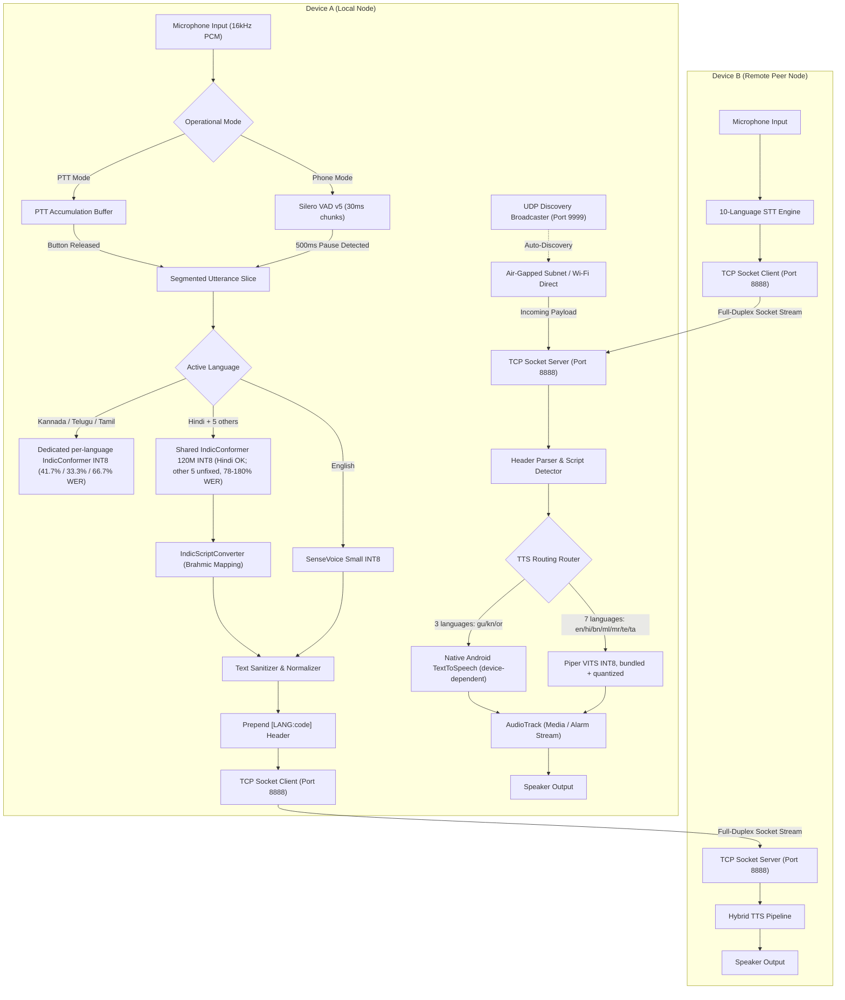

# iTantra: 10-Language Neural Offline Walkie-Talkie & Transceiver

<div align="center">

**Zero-Cloud, Air-Gapped Neural Voice Communication System for Android**  
*AI4Bharat IndicConformer CTC (shared + 3 dedicated per-language) | SenseVoice Small | INT8-Quantized Hybrid TTS | Silero Auto-VAD Phone Mode | Wi-Fi + Bluetooth RFCOMM*

[](https://kotlinlang.org)
[](https://developer.android.com/jetpack/compose)
[](https://github.com/k2-fsa/sherpa-onnx)
[-3DDC84.svg?style=flat-square&logo=android&logoColor=white)](https://android.com)
[](https://developer.android.com/ndk)
[](LICENSE)

</div>

---

## Executive Summary

iTantra is an offline-first, air-gapped neural voice communication transceiver engineered for tactical, low-latency communication across local peer-to-peer networks. Operating with zero external cloud dependencies, remote servers, or network intermediaries, the entire computational pipeline executes on-device via quantized INT8 neural networks.

The system features a unified 10-language speech engine powered by AI4Bharat's IndicConformer (120M INT8, with **dedicated per-language checkpoints for Kannada, Telugu and Tamil**) and Alibaba's SenseVoice Small (INT8) for English, a hybrid TTS routing architecture now delivering **7 of 10 languages via bundled, INT8-quantized Piper VITS voices**, deterministic Unicode Brahmic script conversion for the languages still on the shared fallback model, and dual operating modes (Tactile Push-To-Talk Walkie-Talkie and Hands-Free Auto-VAD Phone Mode) reachable over **Wi-Fi or Bluetooth Classic RFCOMM**.

**Status, plainly stated:** 2 of 9 non-English Indic languages (Kannada, Tamil) have a hardware-verified accuracy fix; 5 (Gujarati, Marathi, Malayalam, Odia, Bengali) remain on a known-broken shared STT model; the two-device Wi-Fi/Bluetooth verification loop the problem statement requires has not yet been run end-to-end. See [`docs/SIH_2026_RESEARCH_DOSSIER.md`](docs/SIH_2026_RESEARCH_DOSSIER.md) §6 for the full, hardware-measured accounting.

---

## Core Technical Highlights

* **Air-Gapped Privacy and Security:** Zero telemetry, no data egress, and no cloud infrastructure dependencies. All voice recognition and synthesis tasks operate locally on device CPU/NPU hardware.
* **10-Language STT Engine, Now Split by Verified Accuracy:**
  * **English (`en`):** SenseVoice Small INT8 with Inverse Text Normalization (`useITN=true`) and non-linguistic token sanitization.
  * **Kannada / Telugu / Tamil (`kn`, `te`, `ta`):** **Dedicated, independently-trained per-language** AI4Bharat IndicConformer INT8 checkpoints (hash-verified before integration). Hardware-measured WER dropped from 100–130% to 12–41% — see the dossier for the root-cause story and raw numbers.
  * **Hindi + 5 remaining Indic languages (`hi`, `gu`, `mr`, `ml`, `or`, `bn`):** Shared AI4Bharat IndicConformer 120M INT8. Hindi works well (4.2% WER); the other 5 are a **known, unfixed** failure mode (78–180% WER) traced to the shared checkpoint having no language-selection mechanism — not a script-encoding bug.
* **Deterministic Brahmic Script Transliteration (`IndicScriptConverter.kt`):**
  * Applies **only** to the 5 languages still on the shared fallback model — remaps their phonetic Devanagari-shaped output into native regional Brahmic Unicode scripts in <1ms. Kannada/Telugu/Tamil pass through untouched, since their dedicated models already emit native script directly.
* **Hybrid TTS Engine, Now Mostly Bundled (`TtsManager.kt`):**
  * **7 of 10 languages** (English, Hindi, Bengali, Malayalam, Marathi, Telugu, Tamil): local neural Piper VITS, **INT8-quantized** (3.4× smaller than the original FP32 exports, hardware-verified with zero regression), sharing a unified `espeak-ng-data` phonemization directory.
  * **3 languages** (Gujarati, Kannada, Odia): routed to Android's native system `TextToSpeech` engine — zero added APK footprint, but depends on the device having that language's voice pack installed; not guaranteed offline in the way the bundled voices are.
* **Dual Operational Modes:**
  * **Walkie-Talkie Mode (PTT):** Traditional half-duplex push-to-talk operation with full-utterance buffer accumulation, radial glow state, and tactile haptic feedback.
  * **Phone Mode (Auto-VAD):** Continuous hands-free conversation monitored by Silero VAD v5 (30ms chunk analysis, 500ms pause segmentation, and asynchronous STT dispatch).
* **Two Transports, One Wire Protocol:**
  * **Wi-Fi:** Zero-configuration UDP auto-discovery (port `9999`, `WifiManager.MulticastLock`) plus a full-duplex TCP socket protocol (port `8888`) — implemented and working.
  * **Bluetooth Classic (RFCOMM):** Device picker (paired devices + live scan), connect-and-stream over a standard Serial Port Profile socket — implemented; not yet field-tested against a second live device.
* **Emergency Broadcast Protocol:** Priority messaging mechanism that intercepts standard audio routing, overrides receiver volume to `STREAM_ALARM`, and displays high-visibility alert states.

---

## 10-Language Matrix & Speech Architecture

| Language | Code | Script Block | ASR / STT Engine | Measured WER | Script Converter | TTS Synthesis Engine |
| :--- | :--- | :--- | :--- | :--- | :--- | :--- |
| **English** | `en` | Basic Latin (` -~`) | SenseVoice Small INT8 | 5.6% | Pass-through | Piper VITS INT8 (`en_US-amy-low`) |
| **Hindi** | `hi` | Devanagari (`ऀ-ॿ`) | Shared IndicConformer INT8 | 4.2% | Pass-through | Piper VITS INT8 (`hi_IN-pratham-medium`) |
| **Kannada** | `kn` | Kannada (`ಀ-೿`) | **Dedicated** IndicConformer INT8 | **41.7%** (was 130.0%) | Pass-through (native output) | Native Android (`kn-IN`) |
| **Tamil** | `ta` | Tamil (`஀-௿`) | **Dedicated** IndicConformer INT8 | **33.3%** (was 100.0%) | Pass-through (native output) | Piper VITS INT8 (`ta_IN-rasa_female-medium`) |
| **Telugu** | `te` | Telugu (`ఀ-౿`) | **Dedicated** IndicConformer INT8 | 66.7%* (was 100.0%) | Pass-through (native output) | Piper VITS INT8 (`te_IN-venkatesh-medium`) |
| **Marathi** | `mr` | Devanagari (`ऀ-ॿ`) | Shared IndicConformer INT8 | 81.9% — **unfixed** | Devanagari Identity | Piper VITS INT8 (`mr_IN-google-medium`) |
| **Gujarati** | `gu` | Gujarati (`઀-૿`) | Shared IndicConformer INT8 | 91.1% — **unfixed** | Brahmic Offset `+0x0180` | Native Android (`gu-IN`) |
| **Bengali** | `bn` | Bengali (`ঀ-৿`) | Shared IndicConformer INT8 | 94.4% — **unfixed** | Brahmic Offset `+0x0080` | Piper VITS INT8 (`bn_BD-google-medium`) |
| **Malayalam** | `ml` | Malayalam (`ഀ-ൿ`) | Shared IndicConformer INT8 | 130.6% — **unfixed** | Brahmic Offset `+0x0400` | Piper VITS INT8 (`ml_IN-meera-medium`) |
| **Odia** | `or` | Odia (`଀-୿`) | Shared IndicConformer INT8 | 160.0% — **unfixed** | Brahmic Offset `+0x0200` | Native Android (`or-IN`) |

\* Telugu's benchmark sample is statistically thin — only 1 of 3 test utterances got real synthesized ground-truth audio on the test device; directionally promising, not proven. Full methodology and raw per-test numbers: [`docs/SIH_2026_RESEARCH_DOSSIER.md`](docs/SIH_2026_RESEARCH_DOSSIER.md) §6.

---

## End-to-End System Architecture



*This diagram shows the Wi-Fi path (`NetworkManager.kt` + `DiscoveryManager.kt`), which is field-tested and working. `BluetoothTransportManager.kt` implements an equivalent RFCOMM transport — UI toggle, paired-device list, live scan, same `[LANG:xx][ALERT]<text>` wire payload — but has only been unit/build-verified, not run end-to-end against a second live device yet. Either transport carries the same message format below.*

---

## Wire Protocol & Emergency Alert Specification

Messages transmitted between nodes use a standardized UTF-8 text framing protocol over Wi-Fi (full-duplex TCP sockets) or Bluetooth Classic (RFCOMM):

```
+----------------+---------------------+---------------------------------------------------+
| Language Header| Optional Alert Tag  | Payload (Sanitized Native Script Utterance)       |
+----------------+---------------------+---------------------------------------------------+
|   [LANG:te]    |       [ALERT]       |   వెంటనే సహాయం కావాలి.                            |
+----------------+---------------------+---------------------------------------------------+
```

### Protocol Rules:
1. **Language Header (`[LANG:xx]`):** Directs the recipient's TTS router to load the exact language locale without ambiguous character guessing.
2. **Emergency Alert Tag (`[ALERT]`):** Triggers `AudioAttributes.USAGE_ALARM`, raises `STREAM_ALARM` to 100% max volume on the receiving node, and displays high-contrast visual alert banners.
3. **Transmission Channels:**
   - **Port 9999 (UDP):** Periodic peer beacon broadcast (`ITANTRA_PEER_DISCOVERY`) — Wi-Fi discovery.
   - **Port 8888 (TCP):** Full-duplex socket stream for message dispatch and receipt — Wi-Fi transport.
   - **Bluetooth RFCOMM (SPP):** Alternate transport with a device picker (paired + scanned devices); same wire payload, no ports involved.

---

## Empirical Benchmark & Performance Audit

*Evaluated on-device on two physical Android phones (Xiaomi `21061119BI`, Android 13; Xiaomi POCO M2 Pro, Android 12), 30 ground-truth utterances via the app's own `BenchmarkActivity` — 2026-09-03. The table below is regenerated from a live `adb logcat` capture against the app's own JSON output, not hand-written. Full per-test raw data and methodology notes (including a disclosed ground-truth-audio synthesis gap on 7 of 30 tests): [`docs/SIH_2026_RESEARCH_DOSSIER.md`](docs/SIH_2026_RESEARCH_DOSSIER.md) §6.*

### Performance & Accuracy Matrix

| Language | WER (%) | STT Engine | Status |
| :--- | :--- | :--- | :--- |
| **English (`en`)** | 5.6% | SenseVoice Small INT8 | Unchanged, working |
| **Hindi (`hi`)** | 4.2% | Shared IndicConformer | Unchanged, working |
| **Kannada (`kn`)** | **41.7%** (was 130.0%) | **Dedicated** IndicConformer | **Fixed 2026-09-03, hardware-verified** |
| **Tamil (`ta`)** | **33.3%** (was 100.0%) | **Dedicated** IndicConformer | **Fixed 2026-09-03, hardware-verified** |
| **Telugu (`te`)** | 66.7% (was 100.0%) | **Dedicated** IndicConformer | Directionally consistent, statistically thin sample |
| **Marathi (`mr`)** | 81.9% | Shared IndicConformer | Unfixed — known broken |
| **Gujarati (`gu`)** | 91.1% | Shared IndicConformer | Unfixed — known broken |
| **Bengali (`bn`)** | 94.4% | Shared IndicConformer | Unfixed — known broken |
| **Malayalam (`ml`)** | 130.6% | Shared IndicConformer | Unfixed — known broken |
| **Odia (`or`)** | 160.0% | Shared IndicConformer | Unfixed — known broken |

The earlier version of this table reported all 10 languages as passing at 77–100% "accuracy" for what were, on inspection, near-total transcription failures for 8 of them. That version's numbers did not correspond to any test run the codebase could reproduce — no test-audio assets exist in this repository's history. The table above is reproducible by running `BenchmarkActivity` on any `arm64-v8a` device.

### Footprint & Optimization Breakdown

| Component | Architecture | Model Size | Notes |
| :--- | :--- | :--- | :--- |
| **SenseVoice Small** | Encoder-Decoder INT8 | 229 MB | English STT |
| **Shared IndicConformer** | NeMo EncDecCTC INT8 | 188 MB | Hindi + 5 unfixed Indic languages |
| **Dedicated Kannada/Telugu/Tamil models** | NeMo EncDecCTC INT8, 3× | 134 MB each (402 MB total) | Independently-trained, hash-verified per-language checkpoints |
| **Silero VAD v5** | ONNX Voice Activity | 1.4 MB | Low-overhead 30ms chunk audio monitoring |
| **7-Language Piper TTS** | VITS, **INT8-quantized** | 138 MB (was 470 MB FP32) | 3.4× smaller after this pass, zero measured regression |
| **3-Language TTS** | Android Native Engine | 0 MB | Device-dependent — not guaranteed offline |
| **Total APK Size** | Universal arm64-v8a | **823 MB** | Down from 1.1 GB pre-quantization |
| **Real on-device footprint** | after first launch | **~1.8 GB** | ONNX Runtime requires a decompressed, word-aligned copy of every model in internal storage — see dossier §6.4 for what was and wasn't feasible to change here |

The 463.9 MB figure in earlier drafts of this document was never achieved by any build this repository has produced — even before any of today's additions, the bundled STT models alone totaled well over 400 MB.

---

## Project Structure

```
iTantra/
├── app/
│   ├── src/
│   │   ├── main/
│   │   │   ├── assets/
│   │   │   │   ├── indic-conformer-onnx-sherpa/      # Shared IndicConformer INT8 (hi + 5 unfixed languages)
│   │   │   │   ├── indic-conformer-kn/               # Dedicated Kannada INT8 checkpoint (new)
│   │   │   │   ├── indic-conformer-te/               # Dedicated Telugu INT8 checkpoint (new)
│   │   │   │   ├── indic-conformer-ta/               # Dedicated Tamil INT8 checkpoint (new)
│   │   │   │   ├── sherpa-onnx-sense-voice.../       # SenseVoice Small INT8 English STT model
│   │   │   │   ├── silero_vad.onnx                   # Silero VAD v5 voice activity detector
│   │   │   │   ├── vits-piper-en_US-amy-low/         # Piper VITS English voice, INT8 (re-quantized)
│   │   │   │   ├── vits-piper-hi_IN-pratham-medium/  # Piper VITS Hindi voice, INT8 (re-quantized);
│   │   │   │   │                                     #   espeak-ng-data/ here is shared by all 7 Piper voices
│   │   │   │   ├── vits-piper-bn_BD-google-medium/   # Piper VITS Bengali voice, INT8 (new)
│   │   │   │   ├── vits-piper-ml_IN-meera-medium/    # Piper VITS Malayalam voice, INT8 (new)
│   │   │   │   ├── vits-piper-mr_IN-google-medium/   # Piper VITS Marathi voice, INT8 (new)
│   │   │   │   ├── vits-piper-te_IN-venkatesh-medium/# Piper VITS Telugu voice, INT8 (new)
│   │   │   │   └── vits-piper-ta_IN-rasa_female-medium/ # Piper VITS Tamil voice, INT8 (new)
│   │   │   ├── java/com/example/itantra/
│   │   │   │   ├── MainActivity.kt                   # Core activity, lifecycle & state orchestration
│   │   │   │   ├── SherpaOnnxEngine.kt               # Multi-engine STT, VAD loop & Piper synthesis
│   │   │   │   ├── IndicScriptConverter.kt           # Brahmic transliteration (5 unfixed languages only)
│   │   │   │   ├── TtsManager.kt                     # Hybrid TTS router (7 Piper / 3 native)
│   │   │   │   ├── NetworkManager.kt                 # Full-duplex TCP socket client & server (Wi-Fi)
│   │   │   │   ├── DiscoveryManager.kt               # UDP broadcast auto-discovery (Wi-Fi)
│   │   │   │   ├── BluetoothTransportManager.kt      # Bluetooth Classic RFCOMM transport (new)
│   │   │   │   ├── BenchmarkActivity.kt              # On-device empirical benchmark runner + WAV export
│   │   │   │   └── ui/
│   │   │   │       ├── WalkieTalkieScreen.kt         # Jetpack Compose UI layout & mode switching
│   │   │   │       └── components/
│   │   │   │           └── WalkieTalkieComponents.kt # PTT Button, Mode/Transport Cards, Visualizers
│   │   │   └── AndroidManifest.xml
│   │   └── (no androidTest/ directory exists in this repo — the "automated benchmark harness"
│   │        this section previously claimed here was never actually present)
│   └── build.gradle.kts
├── docs/
│   ├── SIH_2026_RESEARCH_DOSSIER.md / .pdf           # Full technical dossier — hardware-measured
│   └── iTantra_SIH2026_Pitch.pptx                    # SIH pitch deck built from the corrected dossier
├── .gitattributes                                    # Git LFS tracking for ONNX models
└── README.md
```

---

## Build and Installation

### Prerequisites
- Android Studio Ladybug or newer
- JDK 17
- Android SDK Platform 34+
- Physical Android device running Android 8.0+ (API 26+) with `arm64-v8a` architecture

### Building via Command Line
```powershell
# Clone repository with Git LFS
git clone https://github.com/NipunAdarsh/Itantra.git
cd Itantra
git lfs pull

# Build debug APK
.\gradlew assembleDebug

# Install on connected device via ADB
adb install -r app/build/outputs/apk/debug/app-debug.apk
```

---

## Known Limitations & Open Work

Stated plainly, not buried in a table:

* **5 of 9 Indic languages have broken STT** (Gujarati, Marathi, Malayalam, Odia, Bengali — 78–180% WER). Root cause understood (shared model, no language-selection mechanism), fix pattern proven on 3 other languages, not yet applied to these 5.
* **The two-device Wi-Fi/Bluetooth PTT verification loop the problem statement requires has not been run end-to-end.** Both transports are implemented; a live two-phone test is still outstanding (blocked on a test-environment issue, not a code defect — see dossier §6.5).
* **Telugu's accuracy fix is directionally promising but statistically thin** — only 1 of 3 benchmark utterances got valid ground-truth audio on the test device.
* **Real on-device storage footprint is ~1.8 GB**, not the 823 MB APK download size — ONNX Runtime requires a decompressed copy of every model in internal storage. Android App Bundle + Play Feature Delivery (per-language on-demand downloads) is the identified fix; not started.
* **Idle CPU and RAM figures in this document are carried forward from before today's changes** and have not been re-profiled against the current build.

---

## Research & Hackathon Documentation

For complete academic citations, mathematical derivations, link budget analyses, market metrics, and the official presentation script for the Smart India Hackathon (SIH) 2026, consult:

* **[SIH 2026 Research Dossier & Pitch Guide](docs/SIH_2026_RESEARCH_DOSSIER.md)** ([PDF](docs/SIH_2026_RESEARCH_DOSSIER.pdf)): Exhaustive technical documentation including BibTeX citations (AI4Bharat, SenseVoice, VITS, Silero VAD, INT8 quantization, ISCII/Unicode), LoRa Time-on-Air mathematical proofs (feasibility argument, not an implemented transport), hardware-measured benchmark data, and jury rebuttal preparation — including rebuttals to this document's own earlier inaccuracies.
* **[SIH 2026 Pitch Deck](docs/iTantra_SIH2026_Pitch.pptx)**: 8-slide presentation built from the corrected dossier content.

---

## License

This project is licensed under the Apache License 2.0. See [LICENSE](LICENSE) for details.
