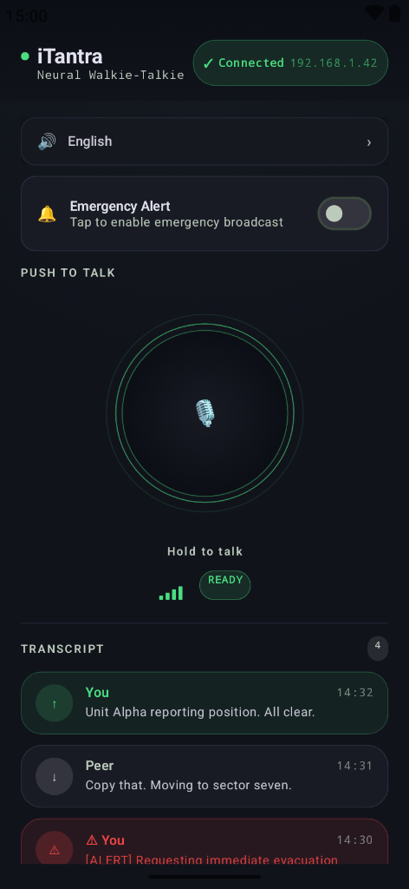
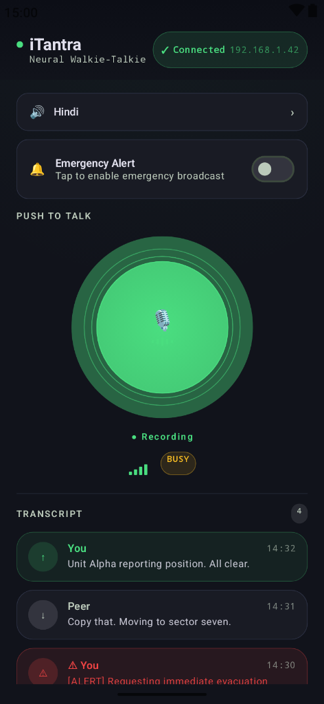
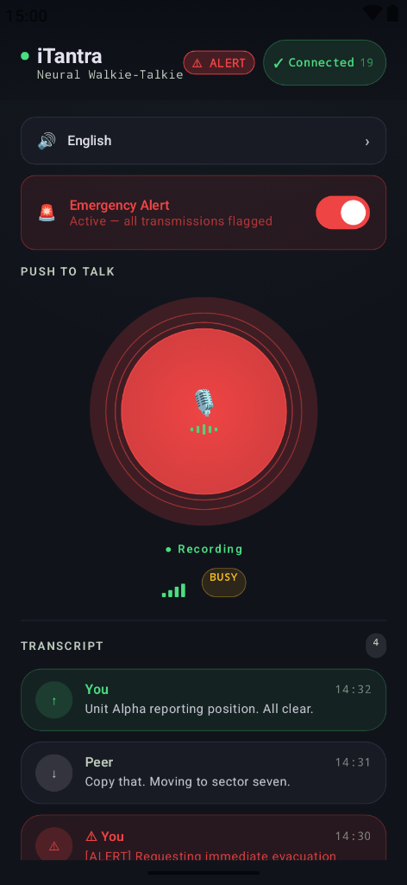
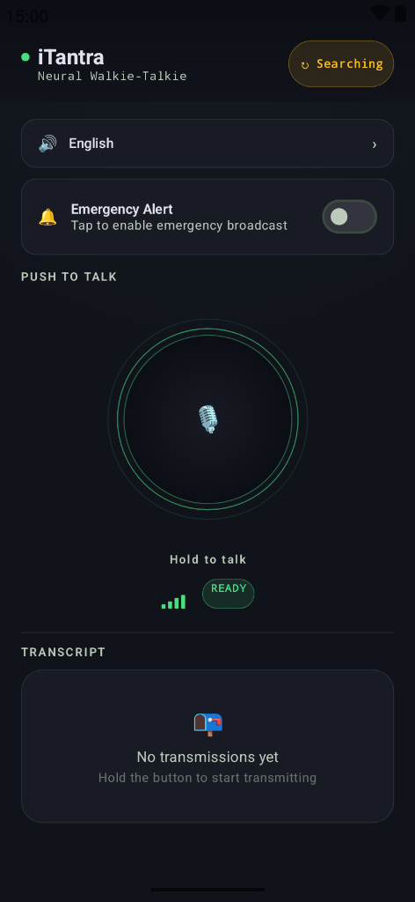
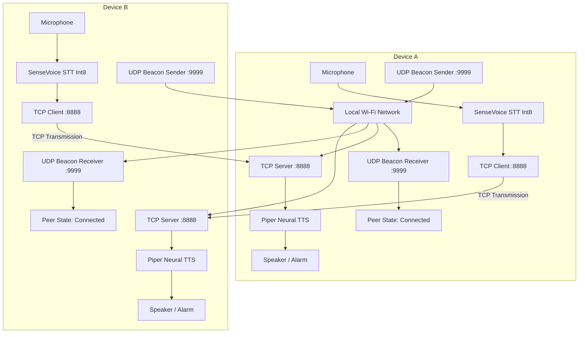

# iTantra - Neural Offline Walkie-Talkie

> **Zero-Cloud, Fully Offline, Neural Voice Walkie-Talkie for Android with P2P Auto-Discovery and Full-Duplex Comms.**

[](https://kotlinlang.org)
[](https://developer.android.com/jetpack/compose)
[](https://github.com/k2-fsa/sherpa-onnx)
[-3DDC84.svg?style=flat&logo=android&logoColor=white)](https://android.com)

---

## 📸 Interface & Visual Showcase

The **Neural Tactical Interface** blends a deep-navy tactical palette with neon green accents, multi-ring glassmorphic depth, and strict adherence to **Apple Human Interface Guidelines (HIG)** and **Material 3**.

| 1. Connected & Ready | 2. Live Recording |
| :---: | :---: |
|  |  |
| **Connected & Idle (English Voice)**<br/>*Shows auto-discovered peer IP (`192.168.1.42`), system readiness badge, signal strength meter, and transcript history with monospace timestamps.* | **Active Neural Recording (Hindi Voice)**<br/>*Vibrant neon green radial glow, active voice waveform bars, and dynamic state transition from READY to BUSY.* |

| 3. Emergency Broadcast | 4. Searching & Discovery |
| :---: | :---: |
|  |  |
| **Emergency Alert Broadcast Mode**<br/>*Red glowing core, top ALERT pill, and audio volume override to `STREAM_ALARM` for critical priority broadcasts.* | **UDP Auto-Discovery & Empty Feed**<br/>*Color-blind safe searching indicator (`↻ Searching`) broadcasting UDP discovery beacons on port 9999.* |

---

## ⚡ What's New

### 1. 📡 UDP Broadcast Auto-Discovery (Zero Manual Setup)
- **No Manual IP Entry**: Devices on the same WiFi network or hotspot automatically discover each other via UDP broadcast beacons on port `9999`.
- **Multicast Lock & Interface Resolution**: Automatically acquires `WifiManager.MulticastLock` and binds across all active network interfaces.
- **Dynamic Header Status**: The status pill automatically transitions from `↻ Searching` to `✓ Connected (X.X.X.X)`.

### 2. 🔄 Full-Duplex Two-Way Communication
- **True Peer-to-Peer**: Both devices run a concurrent TCP server on port `8888` and a TCP client with exponential retry backoff.
- **Simultaneous Comms**: Both devices can transmit voice (STT $\to$ TCP) and receive audio (TCP $\to$ TTS) concurrently without separate "sender" or "receiver" modes.

### 3. 🧠 Thread-Safe Multi-Language Neural Engine
- **Voice Switching**: Dynamic, thread-safe switching between **English (Piper Amy-Low)** and **Hindi (Piper Pratham-Medium)** with zero audio stutter.
- **SenseVoice STT Token Sanitization**: Intelligent regex filtering that purges emotion tokens (`<|...|>`) and special bracket artifacts for crystal-clear transcriptions.
- **Concurrency Protection**: Race-condition guarded playback via `isTtsSwitching` and `ttsReady` states.

### 4. 🎨 Neural Tactical UI & Apple HIG Compliance
- **Inclusive Color Design**: Triple-redundant status indication (`Icon + Text Label + Color Tint`) ensuring 100% accessibility for deuteranopia/protanopia users.
- **Tactile Haptic Engine**: Hardware-calibrated haptics: heavy impact on PTT hold (recording started) and subtle click on release (transmission ended).
- **Motion Discipline**: Clean static idle state with zero continuous battery drain; multi-ring pulse and glow animations activate strictly during transmission.
- **Modal Confirmation**: Built-in safety dialog for high-stakes Emergency Alert toggling.
- **Accessibility & Safe Areas**: 44×44pt minimum touch hitboxes, dynamic TalkBack `semantics`, and edge-to-edge system insets (`statusBarsPadding()` & `navigationBarsPadding()`).

---

## 🏗️ Architecture



---

## 📱 State & Interaction Reference

| State | Visual Indicator | PTT Button | Audio Channel | Action |
|---|---|---|---|---|
| **Searching** | `↻ Searching` (Amber) | Static Dark Circle + Green Border | Standby | Broadcasting UDP beacons on port 9999 |
| **Connected - Idle** | `✓ Connected IP` (Green) | Static Dark Circle + Green Border | Standby | Ready for push-to-talk transmission |
| **Recording (Active)** | `✓ Connected IP` (Green) | Pulsing Neon Green + Waveform Bars | Mic Input (16kHz PCM) | SenseVoice transcribes speech in real-time |
| **Transmitting** | `✓ Connected IP` (Green) | Amber Ring + "▶ Transmitting" | TCP Socket Client | Dispatches message to peer over port 8888 |
| **Emergency Mode** | `⚠ ALERT` (Red Badge) | Pulsing Red Core + Red Ambient Glow | `STREAM_ALARM` Override | Highest priority transmission with volume boost |

---

## 🛠️ Tech Stack & Dependencies

- **Language & Framework**: Kotlin 2.0+, Jetpack Compose, Material 3
- **Speech-to-Text (STT)**: [SenseVoice](https://github.com/FunAudioLLM/SenseVoice) Small (Int8 quantized, offline ONNX)
- **Text-to-Speech (TTS)**: [Piper VITS](https://github.com/rhasspy/piper) (Amy-Low & Pratham-Medium, offline ONNX)
- **Voice Activity Detection (VAD)**: Silero VAD v5
- **On-Device Inference Runtime**: [sherpa-onnx](https://github.com/k2-fsa/sherpa-onnx) v1.13.6 JNI
- **Networking**: Kotlin Coroutines, UDP Broadcast (`9999`), Non-blocking TCP Sockets (`8888`)

---

## 🚀 Getting Started

### 1. Prerequisites
- Two physical Android devices running Android 8.0+ (API 26+) connected to the **same WiFi network** (or one connected to the other's mobile Hotspot).
- [Git LFS](https://git-lfs.github.com/) installed on your machine (required for downloading `.onnx` neural model weights).

### 2. Clone & Pull Model Assets
```bash
git clone https://github.com/NipunAdarsh/Itantra.git
cd Itantra
git lfs pull
```

### 3. Build & Install
Open the project in Android Studio (Ladybug 2024.2.1 or newer) or compile directly using the Gradle wrapper:

```bash
# Clean and assemble the debug APK
./gradlew assembleDebug
```

Output APK will be generated at:
```
app/build/outputs/apk/debug/app-debug.apk
```

### 4. Running the Walkie-Talkie
1. Launch **iTantra** on both devices.
2. Grant the requested **Microphone** and **Location** (required by Android for WiFi P2P discovery) permissions.
3. Devices will automatically discover each other in ~2 seconds and display `✓ Connected <Peer_IP>`.
4. **Press and hold** the central circular button to talk; release when finished. Your speech will be transcribed on-device, transmitted via TCP, and synthesized as natural neural speech on the peer device.

---

## ⚖️ License
This project is an open-source prototype. Please consult the licenses for underlying neural models ([SenseVoice](https://github.com/FunAudioLLM/SenseVoice), [Piper](https://github.com/rhasspy/piper), [Silero VAD](https://github.com/snakers4/silero-vad)) for commercial usage.
