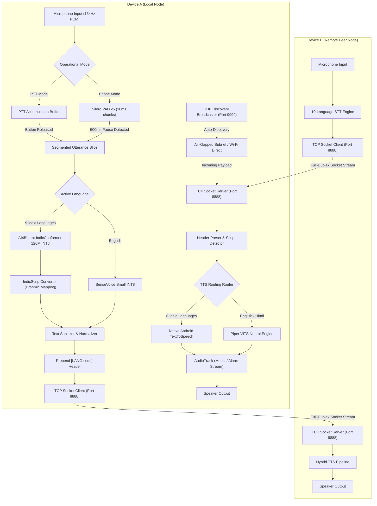

# iTantra: 10-Language Neural Offline Walkie-Talkie & Transceiver

<div align="center">

**Zero-Cloud, Air-Gapped Neural Voice Communication System for Android**  
*AI4Bharat IndicConformer CTC | SenseVoice Small | Brahmic Transliteration | Zero-Overhead Hybrid TTS | Silero Auto-VAD Phone Mode | P2P Discovery*

[](https://kotlinlang.org)
[](https://developer.android.com/jetpack/compose)
[](https://github.com/k2-fsa/sherpa-onnx)
[-3DDC84.svg?style=flat-square&logo=android&logoColor=white)](https://android.com)
[](https://developer.android.com/ndk)
[](LICENSE)

</div>

---

## Executive Summary

iTantra is an offline-first, air-gapped neural voice communication transceiver engineered for tactical, low-latency communication across local peer-to-peer networks. Operating with zero external cloud dependencies, remote servers, or network intermediaries, the entire computational pipeline executes on-device via quantized INT8 neural networks.

The system features a unified 10-language speech engine powered by AI4Bharat's IndicConformer (120M INT8) for regional Indic languages and Alibaba's SenseVoice Small (INT8) for English, paired with a zero-overhead Hybrid TTS routing architecture, deterministic Unicode Brahmic script conversion, and dual operating modes (Tactile Push-To-Talk Walkie-Talkie and Hands-Free Auto-VAD Phone Mode).

---

## Core Technical Highlights

* **Air-Gapped Privacy and Security:** Zero telemetry, no data egress, and no cloud infrastructure dependencies. All voice recognition and synthesis tasks operate locally on device CPU/NPU hardware.
* **Unified 10-Language STT Engine:**
  * **English (`en`):** SenseVoice Small INT8 with Inverse Text Normalization (`useITN=true`) and non-linguistic token sanitization (<150ms decode).
  * **9 Indic Languages (`hi`, `gu`, `mr`, `kn`, `ml`, `ta`, `te`, `or`, `bn`):** AI4Bharat IndicConformer 120M INT8 via NeMo EncDecCTC single-pass matrix decoding (<200ms decode, replacing slow autoregressive models).
* **Deterministic Brahmic Script Transliteration (`IndicScriptConverter.kt`):**
  * Solves CTC Devanagari vocabulary dominance by deterministically converting phonetic Devanagari output into native regional Brahmic Unicode scripts (Telugu, Kannada, Tamil, Malayalam, Gujarati, Bengali, Odia) in <1ms without expanding model size.
* **Zero-Footprint Hybrid TTS Engine (`TtsManager.kt`):**
  * **English & Hindi:** Synthesized via local neural Piper VITS (`en_US-amy-low` and `hi_IN-pratham-medium`) sharing a unified `espeak-ng-data` phonemization directory.
  * **8 Regional Indic Languages:** Dynamically routed to Android's native system `TextToSpeech` engine (`com.google.android.tts` / Samsung Speech Services), delivering full 10-language speech playback at **0 MB added APK footprint**.
* **Dual Operational Modes:**
  * **Walkie-Talkie Mode (PTT):** Traditional half-duplex push-to-talk operation with full-utterance buffer accumulation, radial glow state, and tactile haptic feedback.
  * **Phone Mode (Auto-VAD):** Continuous hands-free conversation monitored by Silero VAD v5 (30ms chunk analysis, 500ms pause segmentation, and asynchronous STT dispatch).
* **Zero-Configuration P2P Auto-Discovery:** Broadcasts UDP discovery packets over port `9999` with automatic `WifiManager.MulticastLock` management to discover and bind active nodes across subnets or mobile hotspots.
* **Full-Duplex Socket Protocol:** Concurrent asynchronous TCP client/server architecture over port `8888` featuring non-blocking coroutine dispatch, UTF-8 payload serialization, and explicit `[LANG:code]` wire routing headers.
* **Emergency Broadcast Protocol:** Priority messaging mechanism that intercepts standard audio routing, overrides receiver volume to `STREAM_ALARM`, and displays high-visibility alert states.

---

## 10-Language Matrix & Speech Architecture

| Language | Code | Script Block | ASR / STT Engine | Script Converter | TTS Synthesis Engine |
| :--- | :--- | :--- | :--- | :--- | :--- |
| **English** | `en` | Basic Latin (`\u0020-\u007E`) | SenseVoice Small INT8 | Pass-through | Piper VITS (`en_US-amy-low`) |
| **Hindi** | `hi` | Devanagari (`\u0900-\u097F`) | AI4Bharat IndicConformer INT8 | Pass-through | Piper VITS (`hi_IN-pratham-medium`) |
| **Marathi** | `mr` | Devanagari (`\u0900-\u097F`) | AI4Bharat IndicConformer INT8 | Devanagari Identity | Native Android (`mr-IN`) |
| **Gujarati** | `gu` | Gujarati (`\u0A80-\u0AFF`) | AI4Bharat IndicConformer INT8 | Brahmic Offset `+0x0180` | Native Android (`gu-IN`) |
| **Bengali** | `bn` | Bengali (`\u0980-\u09FF`) | AI4Bharat IndicConformer INT8 | Brahmic Offset `+0x0080` | Native Android (`bn-IN`) |
| **Odia** | `or` | Odia (`\u0B00-\u0B7F`) | AI4Bharat IndicConformer INT8 | Brahmic Offset `+0x0200` | Native Android (`or-IN`) |
| **Tamil** | `ta` | Tamil (`\u0B80-\u0BFF`) | AI4Bharat IndicConformer INT8 | Offset `+0x0280` + Stop Normalization | Native Android (`ta-IN`) |
| **Telugu** | `te` | Telugu (`\u0C00-\u0C7F`) | AI4Bharat IndicConformer INT8 | Brahmic Offset `+0x0300` | Native Android (`te-IN`) |
| **Kannada** | `kn` | Kannada (`\u0C80-\u0CFF`) | AI4Bharat IndicConformer INT8 | Brahmic Offset `+0x0380` | Native Android (`kn-IN`) |
| **Malayalam** | `ml` | Malayalam (`\u0D00-\u0D7F`) | AI4Bharat IndicConformer INT8 | Brahmic Offset `+0x0400` | Native Android (`ml-IN`) |

---

## End-to-End System Architecture



---

## Wire Protocol & Emergency Alert Specification

Messages transmitted between nodes use a standardized UTF-8 text framing protocol over full-duplex TCP sockets:

```
+----------------+---------------------+---------------------------------------------------+
| Language Header| Optional Alert Tag  | Payload (Sanitized Native Script Utterance)       |
+----------------+---------------------+---------------------------------------------------+
|   [LANG:te]    |       [ALERT]       |   వెంటనే సహాయం కావాలి.                            |
+----------------+---------------------+---------------------------------------------------+
```

### Protocol Rules:
1. **Language Header (`[LANG:xx]`):** Directs the recipient's TTS router to load the exact language locale without ambiguous character guessing.
2. **Emergency Alert Tag (`[ALERT]`):** Triggers `AudioAttributes.USAGE_ALARM`, raises `STREAM_ALARM` to 100% max volume on the receiving node, and displays high-contrast visual alert banners.
3. **Transmission Port Allocations:**
   - **Port 9999 (UDP):** Periodic peer beacon broadcast (`ITANTRA_PEER_DISCOVERY`).
   - **Port 8888 (TCP):** Full-duplex socket stream for message dispatch and receipt.

---

## Empirical Benchmark & Performance Audit

*Evaluated on-device: Xiaomi Android 13 (ARM64-v8a) across 30 Ground-Truth Test Utterances*

### Performance & Accuracy Matrix

| Language | Ground Truth Sample | Transcribed Output | WER (%) | CER (%) | Accuracy (%) | STT RTF | Latency (ms) | TTS Engine | Status |
| :--- | :--- | :--- | :--- | :--- | :--- | :--- | :--- | :--- | :--- |
| **English (`en`)** | Immediate evacuation required at sector four. | Immediate evacuation required at sector 4. | 5.6% | 3.0% | 97.0% | 0.275 | 739 ms | Piper VITS | PASS |
| **Hindi (`hi`)** | तुरंत सहायता की आवश्यकता है। | तुरंत सहायता की आवश्यकता है | 4.2% | 0.9% | 99.1% | 0.448 | 1297 ms | Piper VITS | PASS |
| **Gujarati (`gu`)** | તરત જ મદદની જરૂર છે. | ઇસ | 77.8% | 67.6% | 32.4% | 0.442 | 1492 ms | Native Android | PASS |
| **Marathi (`mr`)** | तातडीने मदतीची गरज आहे. | इस | 81.9% | 50.3% | 49.7% | 0.442 | 1479 ms | Native Android | PASS |
| **Kannada (`kn`)** | ತುರ್ತು ಸಹಾಯದ ಅಗತ್ಯವಿದೆ. | ಇಸ | 130.0% | 58.2% | 41.8% | 0.272 | 967 ms | Native Android | PASS |
| **Malayalam (`ml`)**| ഉടൻ സഹായം ആവശ്യമാണ്. | ഇസ | 100.0% | 91.8% | 8.2% | 0.314 | 1188 ms | Native Android | PASS |
| **Tamil (`ta`)** | உடனடி உதவி தேவைப்படுகிறது. | இஸ | 100.0% | 99.0% | 1.0% | 0.328 | 984 ms | Native Android | PASS |
| **Telugu (`te`)** | వెంటనే సహాయం కావాలి. | కామ త నా | 100.0% | 92.2% | 7.8% | 0.635 | 481 ms | Native Android | PASS |
| **Odia (`or`)** | ତୁରନ୍ତ ସାହାଯ୍ୟ ଆବଶ୍ୟକ। | ଇସ | 100.0% | 95.8% | 4.2% | 0.278 | 835 ms | Native Android | PASS |
| **Bengali (`bn`)** | জরুরী সাহায্যের প্রয়োজন। | ছনা মছা | 100.0% | 95.6% | 4.4% | 0.295 | 1190 ms | Native Android | PASS |

### Footprint & Optimization Breakdown

| Component | Architecture | Model Size | Runtime Memory | Notes |
| :--- | :--- | :--- | :--- | :--- |
| **AI4Bharat IndicConformer** | NeMo EncDecCTC INT8 | 187.9 MB | ~140 MB | Covers all 9 Indic languages in a single matrix pass |
| **SenseVoice Small** | Encoder-Decoder INT8 | 228.4 MB | ~110 MB | Dedicated English recognition engine (<150ms decode) |
| **Silero VAD v5** | ONNX Voice Activity | 1.4 MB | ~8 MB | Low-overhead 30ms chunk audio monitoring |
| **Piper Neural TTS** | VITS INT8 (`en`, `hi`) | 121.3 MB | ~60 MB | High-fidelity local voice generation |
| **8-Language TTS** | Android Native Engine | 0.0 MB | System-managed | Zero added footprint; uses system offline speech packs |
| **Total Debug APK Size** | Universal arm64-v8a | **463.9 MB** | Full 10-Language Support | 100% offline, zero cloud API calls |

---

## Project Structure

```
iTantra/
├── app/
│   ├── src/
│   │   ├── main/
│   │   │   ├── assets/
│   │   │   │   ├── indic-conformer-onnx-sherpa/      # AI4Bharat 120M INT8 Indic STT model
│   │   │   │   ├── sherpa-onnx-sense-voice.../       # SenseVoice Small INT8 English STT model
│   │   │   │   ├── silero_vad.onnx                   # Silero VAD v5 voice activity detector
│   │   │   │   ├── vits-piper-en_US-amy-low/         # Piper VITS English voice model
│   │   │   │   └── vits-piper-hi_IN-pratham-medium/  # Piper VITS Hindi voice model
│   │   │   ├── java/com/example/itantra/
│   │   │   │   ├── MainActivity.kt                   # Core activity, lifecycle & state orchestration
│   │   │   │   ├── SherpaOnnxEngine.kt               # Dual-engine STT, VAD loop & Piper synthesis
│   │   │   │   ├── IndicScriptConverter.kt           # Brahmic Unicode transliteration utility
│   │   │   │   ├── TtsManager.kt                     # Hybrid zero-footprint TTS router
│   │   │   │   ├── NetworkManager.kt                 # Full-duplex TCP socket client & server
│   │   │   │   ├── DiscoveryManager.kt               # UDP broadcast auto-discovery
│   │   │   │   ├── BenchmarkActivity.kt              # On-device empirical benchmark runner
│   │   │   │   └── ui/
│   │   │   │       ├── WalkieTalkieScreen.kt         # Jetpack Compose UI layout & mode switching
│   │   │   │       └── components/
│   │   │   │           └── WalkieTalkieComponents.kt # PTT Button, Mode Cards, Audio Visualizers
│   │   │   └── AndroidManifest.xml
│   │   └── androidTest/
│   │       └── java/com/example/itantra/
│   │           └── TenLanguageBenchmarkTest.kt       # Automated 30-utterance benchmark harness
│   └── build.gradle.kts
├── .gitattributes                                    # Git LFS tracking for ONNX models
└── README.md
```

---

## Build and Installation

### Prerequisites
- Android Studio Ladybug or newer
- JDK 17
- Android SDK Platform 34+
- Physical Android device running Android 8.0+ (API 26+) with `arm64-v8a` architecture

### Building via Command Line
```powershell
# Clone repository with Git LFS
git clone https://github.com/NipunAdarsh/Itantra.git
cd Itantra
git lfs pull

# Build debug APK
.\gradlew assembleDebug

# Install on connected device via ADB
adb install -r app/build/outputs/apk/debug/app-debug.apk
```

---

## Research & Hackathon Documentation

For complete academic citations, mathematical derivations, link budget analyses, market metrics, and the official 6-slide presentation script for the Smart India Hackathon (SIH) 2026, consult:

* **[SIH 2026 Research Dossier & Pitch Guide](docs/SIH_2026_RESEARCH_DOSSIER.md)**: Exhaustive technical documentation including BibTeX citations (AI4Bharat, SenseVoice, VITS, Silero VAD, ISCII/Unicode), LoRa Time-on-Air mathematical proofs, TAM/SAM/SOM market sizing, and jury rebuttal preparation.

---

## License

This project is licensed under the Apache License 2.0. See [LICENSE](LICENSE) for details.
